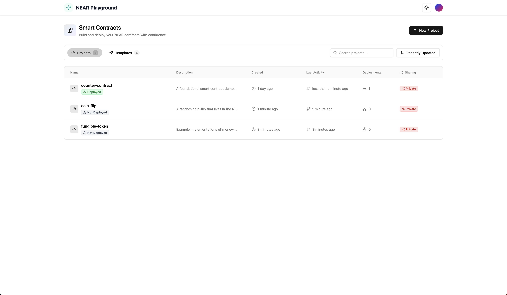
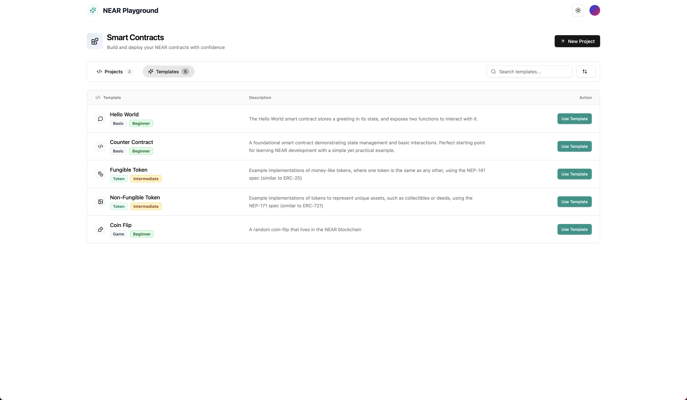
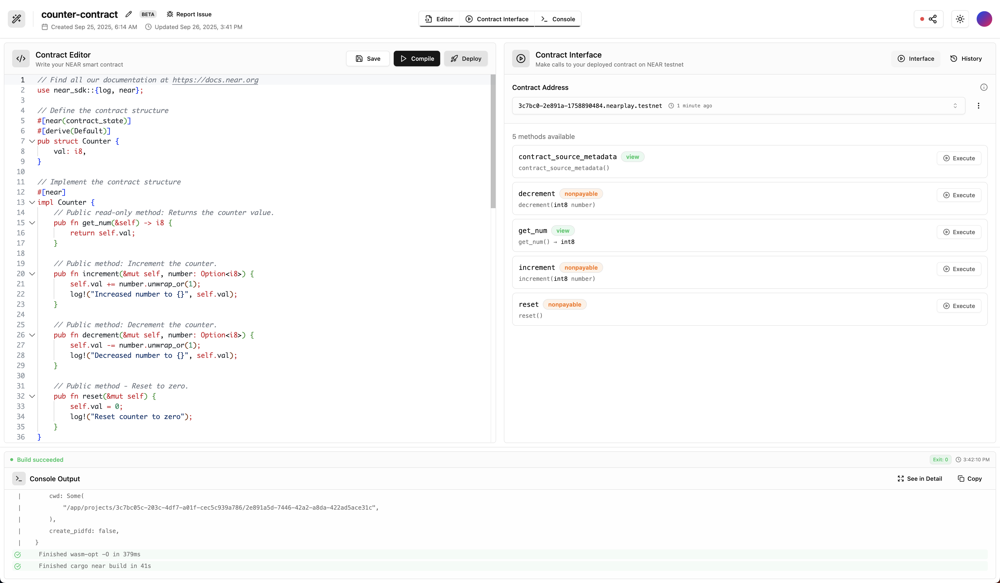
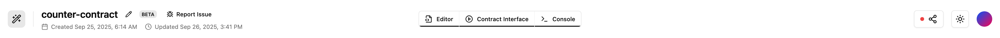
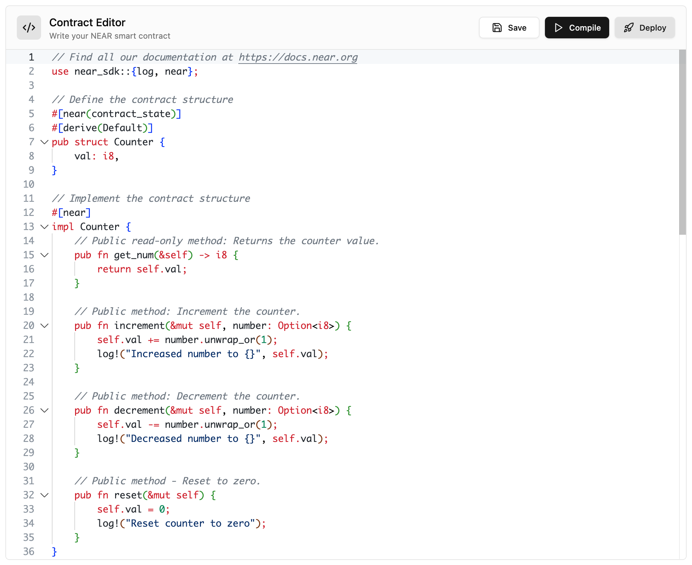
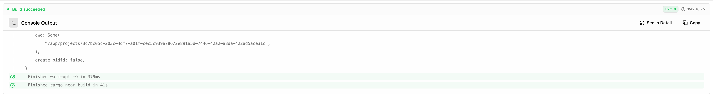
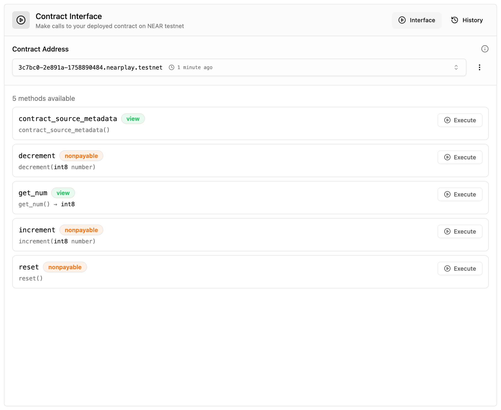

# NEAR Playground User Guide

A complete browser-based IDE for NEAR smart contract development. Write, compile, deploy, and interact with contracts without any setup.

## Getting Started

**Login Process:**
1. Click "Launch IDE" on the homepage
2. Enter your **email address** or use **Continue with GitHub** option
3. Click the magic link sent to your email
4. Automatic redirect to your projects dashboard

No passwords needed - secure magic link authentication.

---

## Projects Dashboard

- **Deployment Count** - Number of times deployed to NEAR testnet
- **Created Date** - When the project was first created
- **Last Activity** - Most recent update or compilation
- **Actions** - Open, edit name/description, or delete projects

## Templates

Pre-built smart contract templates to get started quickly:

### Available Templates:
1. **Hello World** (Beginner) - Basic contract structure with greeting storage
2. **Counter** (Beginner) - Increment/decrement with state management
3. **Fungible Token** (Intermediate) - NEP-141 token standard implementation
4. **Non-Fungible Token** (Intermediate) - NEP-171 NFT standard
5. **Coin Flip** (Beginner) - Random number generation and gaming logic

### Using Templates:
1. Switch to "Templates" tab
2. Browse available options
3. Click "Use Template"
4. Enter project name and description
5. Project created with pre-loaded code

---

## Playground (Editor Interface)

The complete development environment with three main views: **Editor**, **Contract Interface**, and **Console Output**.

### Header Section

- **Project Name** - Click to edit inline
- **Timestamps** - Shows created date and last updated
- **Share Button** - Toggle public/private with status indicator (red/green dot)
- **Theme Toggle** - Switch between light/dark modes

---

## Editor View

- **Rust Syntax Highlighting** - Full language support
- **Auto-completion** - NEAR SDK suggestions
- **Auto-save** - Changes saved automatically as you type
- **Manual Save** - Ctrl+S (Cmd+S on Mac)

**Action Buttons:**
- **Compile** - Build contract using cargo-near backend service
- **Deploy** - Deploy to NEAR testnet (requires successful compilation)

**Behind the Scenes:**
- Code sent to secure Rust backend service
- Compiled using official cargo-near toolchain
- Generates WASM binary and extracts ABI
- Auto-creates funded testnet account for deployment

---

## Console View

**Compilation Logs:**

- **Real-time Output** - Live compilation progress
- **Error Detection** - Syntax and build errors with line numbers
- **Success Messages** - Confirmation of successful builds
- **Build Metrics** - Compilation time and exit codes

---

## Contract Interface

Auto-Generated from Last Successful Compilation:

- **Method Detection** - All contract functions automatically discovered
- **Method Types**:
  - **View Methods** (Green) - Read-only, no gas fees
  - **Call Methods** (Blue) - Modify state, require gas

**Features:**

- **Parameter Input** - Form fields for method arguments
- **Type Conversion** - Handles different data types (integers, strings, objects)
- **Execution History** - Track all method calls and results
- **Transaction Details** - View hash, gas used, outcomes

**Method Execution:**

1. Select method to call
2. Fill in required parameters
3. Click View (instant) or Call (transaction)
4. See results and updated contract state

---

**Ready to build on NEAR? Start coding in seconds with zero setup required. Visit [NEAR Playground](https://nearplay.app) to get started!**