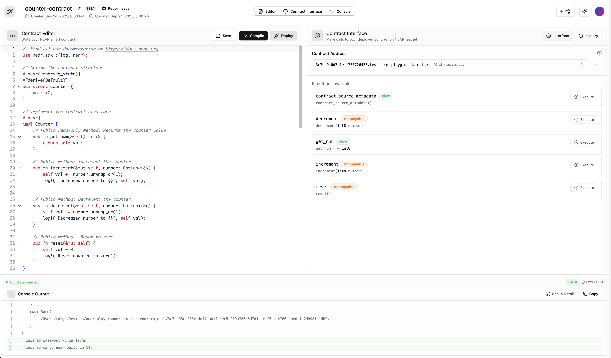

  <h1>
    NEAR Playground
  </h1>

  

    Write, compile, and deploy NEAR smart contracts using Rust directly in your browser.
  

  

    <a href="https://nearplay.app">nearplay.app</a> &nbsp;|&nbsp; <a href="https://docs.nearplay.app">Documentation</a>
  

   

  

## 📚 Examples

Try these example contracts directly in NEAR Playground:

| Example | Description | Source | Try It |
|---------|-------------|--------|--------|
| **Counter** | The smart contract exposes methods to interact with a counter stored in the NEAR network | [GitHub](https://github.com/near-examples/counters/tree/main/contract-rs) |  |
| **Hello World** | Simple Hello World smart contract in Rust | [GitHub](https://github.com/near-examples/hello-near-examples/tree/main/contract-rs) |  |
| **Non-Fungible Token** | NEP-171 token implementation for unique assets like collectibles (similar to ERC-721) | [GitHub](https://github.com/near-examples/NFT) |  |
| **Fungible Token** | NEP-141 token implementation for money-like tokens (similar to ERC-20) | [GitHub](https://github.com/near-examples/FT) |  |

*Examples sourced from [near-examples](https://github.com/near-examples)*

## ✨ Features

NEAR Playground is a browser-based development environment that makes NEAR smart contract development simple and accessible.

- **Multi-File Code Editor** - Professional IDE with file explorer, tabs, and cross-file search
- **Dependency Management** - Add crates from crates.io with one-click integration
- **Integrated Terminal** - Full NEAR CLI and Cargo access in browser
- **Instant Compilation** - Compile Rust to WASM using cargo-near in seconds
- **Multi-Network Deployment** - Deploy to testnet or mainnet with wallet integration
- **Smart Contract Testing** - Built-in test runner with output parsing
- **Contract Verification** - Verify source code for mainnet transparency
- **Deployment Dashboard** - Track all deployments across networks
- **GitHub Import/Export** - Import from GitHub or export as ZIP
- **Testnet Faucet** - Get test NEAR tokens instantly
- **Template Marketplace** - Discover and share community templates
- **Embeddable Buttons** - "Open in NearPlay" buttons for documentation

## 💫 NEAR Playground vs Traditional Setup

| Feature | Traditional Setup | NEAR Playground |
|---------|-------------------|-----------------|
| Initial Setup | 30+ minutes of installation & configuration | < 30 seconds - just open browser |
| Prerequisites | Rust toolchain, NEAR CLI, Node.js, VS Code | Modern web browser only |
| Development | Local machine setup with multiple tools | Fully browser-based IDE |
| Multi-File Projects | Standard local development | Full file explorer with multi-file editing |
| Dependencies | Manual Cargo.toml editing | Visual crate search & one-click add |
| Terminal Access | Local terminal required | Integrated browser terminal |
| Compilation | Local cargo-near setup and configuration | Instant cloud compilation |
| Testnet Deployment | Manual NEAR wallet & testnet configuration | One-click with pre-funded wallet |
| Mainnet Deployment | Complex wallet & key management | Seamless wallet selector integration |
| Testing | Local test environment setup | Integrated test runner with output parsing |
| Contract Verification | Manual verification process | Built-in verification workflow |
| GitHub Integration | Standard git workflow | One-click import & export |
| Updates | Manual toolchain updates | Always up-to-date platform |
| Collaboration | Complex environment sharing | Instant contract sharing |
